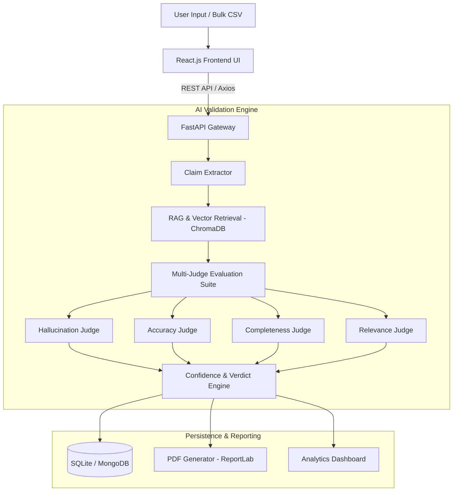

# 📋 Project Agenda: AI Response Validation System with Hallucination Detection Assistance

> **Infosys Internship Project — v2.0**  
> **Author:** Pranitha Pindi  
> **Repository:** `Development-of-AI-Response-Validation-System-with-Hallucination-Detection-Assistance-`

---

## 🎯 1. Executive Summary & Purpose

The overarching agenda of this project is to address the **critical vulnerability of factual hallucinations in Large Language Models (LLMs)**. While generative AI models produce highly fluent and persuasive text, they frequently generate ungrounded, fabricated, or contradictory information.

This project delivers an automated, enterprise-ready **AI Response Validation & Quality Assurance Gateway** that inspects, scores, and verifies AI responses against factual references and grounded knowledge before those outputs reach end users.

---

## 🚨 2. The Core Problem Statement

1. **Unreliable Generative AI Outputs**:
   - LLMs suffer from hallucinations (generating plausible-sounding but completely false facts).
2. **Lack of Automated Verification Tools**:
   - Manual fact-checking is slow, costly, and cannot scale with high-throughput conversational AI.
3. **Enterprise Compliance & Trust Risks**:
   - Deploying unverified AI responses in sensitive domains (finance, healthcare, legal, customer support) poses severe legal, ethical, and operational risks.

---

## 🚀 3. Primary Objectives & Goals

| Objective | Description | Target Metric / Deliverable |
|---|---|---|
| **Claim-Level Fact Extraction** | Decompose complex AI paragraphs into granular, atomic factual propositions. | Automated NLP Claim Extractor |
| **Evidence-Grounded Verification** | Cross-reference extracted claims against trusted reference context using Vector Search & RAG. | ChromaDB + SentenceTransformers Embeddings |
| **Multi-Dimensional AI Evaluation** | Evaluate AI responses across 4 core dimensions: *Hallucination*, *Accuracy*, *Completeness*, and *Relevance*. | Multi-Judge Scoring Pipeline |
| **Unified Confidence & Verdicts** | Combine dimensional scores into a clear trust classification (*Validated*, *Partial Hallucination*, *High-Risk*). | Automated Confidence Scorer |
| **Batch Benchmarking & Auditing** | Enable bulk evaluation via CSV datasets to benchmark LLM models and maintain an audit trail. | Batch Evaluator + PDF Report Generator |
| **Full-Stack Web Interface** | Provide an intuitive dashboard with dark/light themes, analytics visualizations, and real-time validation. | React 18 + Vite + Tailwind CSS |

---

## 🔬 4. Technical Work Breakdown & Architecture

### Key Modules & Responsibilities:
1. **Claim Extraction (`claim_extractor.py`)**:
   - Parses response sentences into testable factual statements.
2. **Semantic Knowledge Base (`vector_store.py` & `rag_pipeline.py`)**:
   - Uses `all-MiniLM-L6-v2` embeddings in ChromaDB to retrieve relevant factual context.
3. **Multi-Faceted Judge System**:
   - `hallucination_judge.py`: Flags fabricated claims.
   - `accuracy_judge.py`: Evaluates semantic alignment with ground truth.
   - `completeness_judge.py`: Verifies prompt coverage.
   - `relevance_judge.py`: Measures contextual alignment and topic drift.
4. **Scoring & Risk Engine (`confidence_scorer.py` & `verdict_judge.py`)**:
   - Computes weighted composite reliability scores.
5. **Reporting & Auditing (`pdf_generator.py` & `analytics.py`)**:
   - Generates downloadable audit reports and aggregates performance trends.

---

## 📅 5. Expected Outcomes & Deliverables

* ✅ **Production-Ready Validation Web Application**: Responsive web interface with single-response validation, bulk testing, and history logs.
* ✅ **Comprehensive REST API**: Scalable FastAPI endpoints (`/api/validate`, `/api/batch`, `/api/history`, `/api/analytics`).
* ✅ **Automated Audit Documentation**: PDF report generator for compliance and quality control.
* ✅ **Model-Agnostic Benchmarking**: Ability to evaluate outputs from OpenAI, Gemini, Claude, Ollama, or custom fine-tuned LLMs.

---

## 📈 6. Target Audience & Applications

* **Enterprise AI Deployments**: Guardrail for customer-facing chatbots and automated support agents.
* **LLM Engineering & Fine-tuning Teams**: Benchmarking suite to measure model regression and hallucination rates across training runs.
* **Content Generation & Compliance**: Automated fact-checking assistant for technical documentation, research summaries, and educational material.
